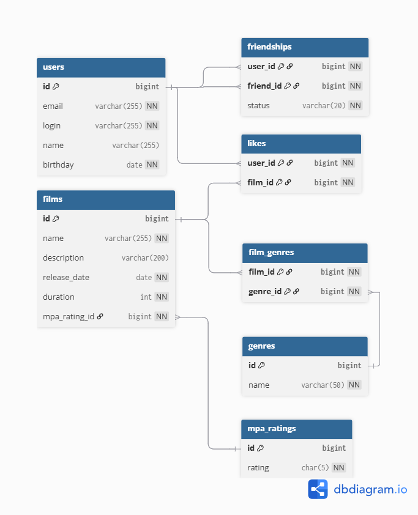

# java-filmorate
Template repository for Filmorate project.

## ER-диаграмма базы данных
Ниже представлена схема базы данных, используемая в приложении:

## Пояснение к схеме
- `users` — хранит информацию о пользователях.
- `films` — хранит фильмы, доступные пользователям.
- `friendships` — статус связи между пользователями (дружба).
- `likes` — таблица лайков от пользователей.
- `genres` — справочник жанров.
- `film_genres` — связь фильмов с жанрами (многие-ко-многим).
- `mpa_ratings` — справочник возрастных рейтингов (MPA).

## Примеры SQL-запросов

### 1. Получить список всех фильмов с жанрами и рейтингами
sql
SELECT f.id,
       f.name,
       f.description,
       g.name   AS genre,
       m.rating AS mpa_rating
FROM films f
JOIN film_genres fg ON f.id = fg.film_id
JOIN genres g ON fg.genre_id = g.id
JOIN mpa_ratings m ON f.mpa_rating_id = m.id;

### 2. Получить фильмы, которым поставили лайки
sql
SELECT f.id, f.name, f.description
FROM likes l
JOIN films f ON l.film_id = f.id
WHERE l.user_id = 1;